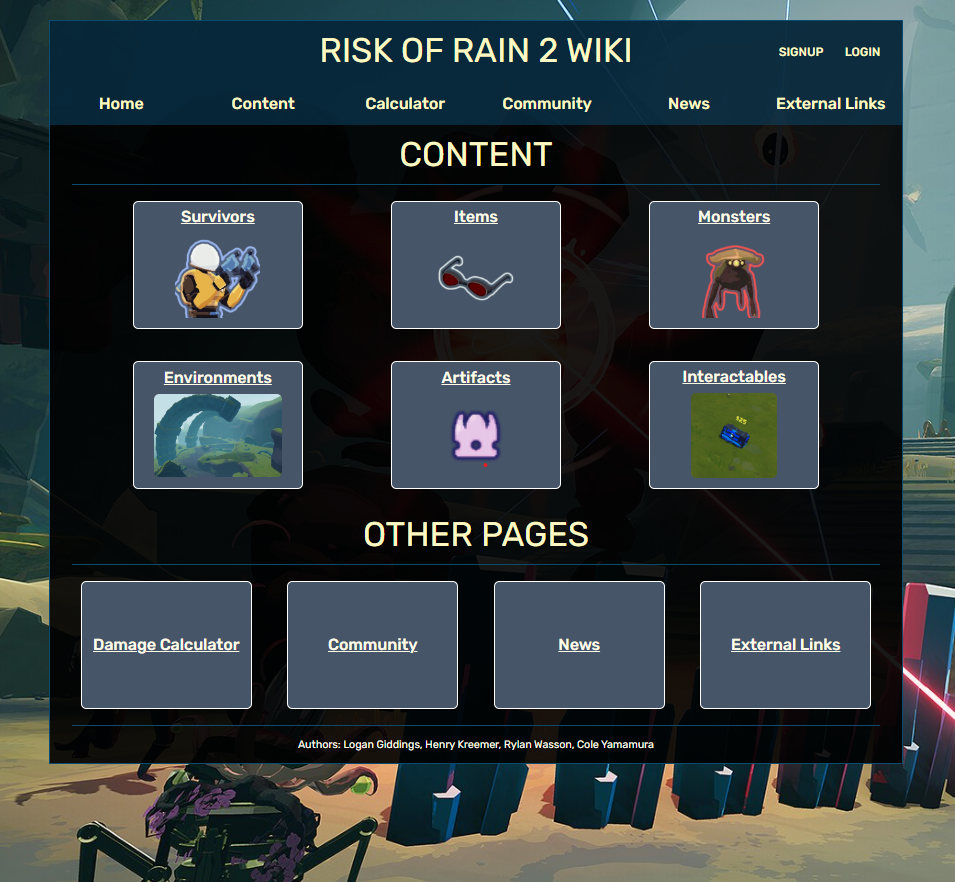

# Project: Risk of Rain 2 Wiki
This project is a wiki page for the game 'Risk of Rain 2'

It contains six 'content' pages detailing certain aspects of the game

It also contains four other pages: Damage Calculator, Community, News, and External Links

It also contains pages for signup, login, account, and 404 (Page not Found)

## Set-Up:
- Clone git repository

### Initializing npm:
- Navigate to `server/` directory
- Run `npm install`
- Navigate to `site/` directory
- Run `npm install`

### Running the code:
- 
- To start the website/frontend: Navigate to `site/` directory and run `npm run dev`
- To start the server/backend: Navigate to `server/` directory and run `npm run server` 

### Running tests:
- Navigate to `site/` directory
- Run `npm run test` to run regular tests
- Run `npm run test-coverage` to show test coverage

## Navigation/Routes
- `/` - Homepage
- `/survivors` - Survivors Page
- `/items` - Iitems Page
- `/monsters` - Monsters Page
- `/environments` - Environments Page
- `/artifacts` - Artifacts Page
- `/interactables` - Interactables Page
- `/calculator` - 'Damage Calculator' Page
- `/community` - Community Page
- `/news` - News Page
- `/links` - External Links Page
- `/signup` - Signup Page
- `/login` - Login Page
- `/account` - Account Page
- `*` - 404 Page

### Authors: Rylan Wasson, Henry Kreemer, Logan Giddings, Cole Yamamura
